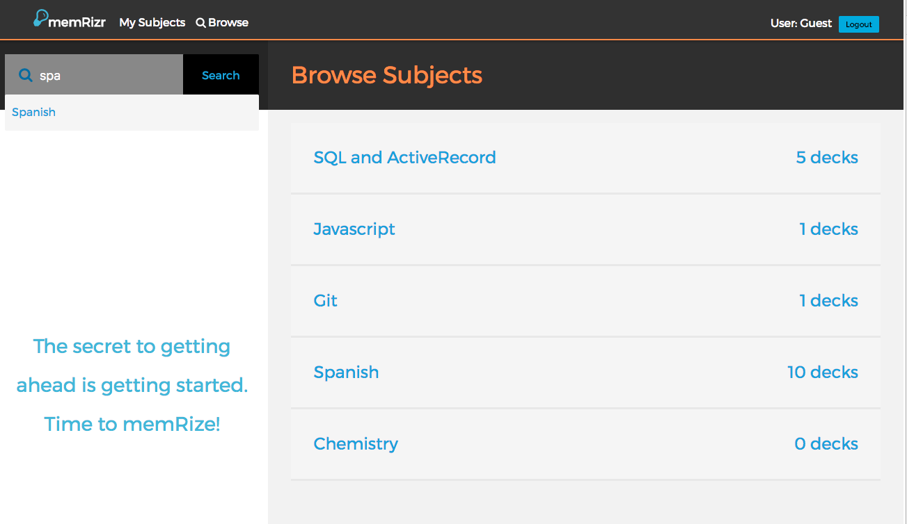
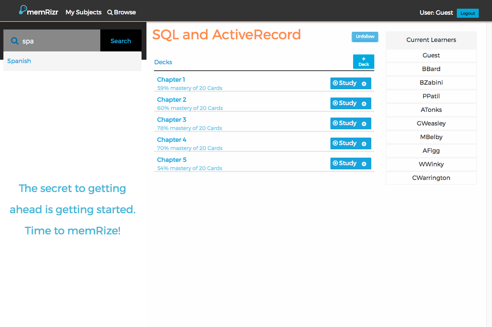
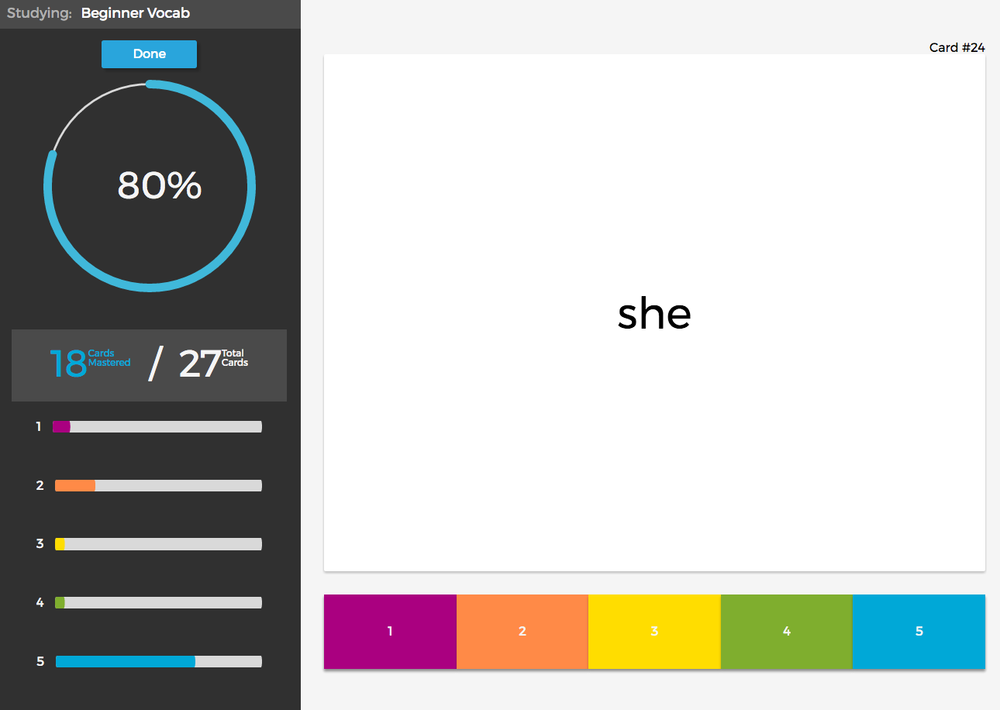

# memRizr
[Live](https://memrizr.herokuapp.com)

memRizr is a web application that facilitates community learning through the creation, sharing and curation of flashcard decks. It was built using Ruby on Rails, React/Redux, and PostgreSQL.

## Technologies
Rails is a back-end MVC web framework that was used for data fetching and storage with a connection to a PostGreSQL database. Rails potential to get up and running as a simple RESTful API was part of its appeal as a back end. The front end application was written using javascript's React library for reuseable, modular code. It was used in conjunction with the Redux framework to add in the benefits of a unidirectional dataflow which made the application easier to debug.

## Features & Implementation
### Subjects, Following, and Searching
Decks are organized on a high level by subject. Subjects can contain multiple decks that help their user to train specific subsets of that topic matter.

A user can browse the current offerings of subjects and decks through the search functionality and then subscribe or follow a subject of interest. Following a subject will cause that subject, its decks and the user's progress through the mastery of those decks to appear in the "my subjects" view of the application.

Search queries are processed on the back-end by the subjects controller. The search bar has dropdown functionality as show below to populate results quickly after the user enters at least 2 characters.



The searchbar component uses a separate slice of application state to populate the drop down with results. It hits the same API endpoint on the back end, but chains off of the promise to dispatch a different action than when the user hits the submit button. When the user submits a query, the list to the right of the screen re-renders with the search results. All results in both the dropdown and subject list are links to the subject detail view where the user can follow or study the available subject or decks respectively as shown below:



### Studying and ConfidenceRatings
A User can study a deck. The User can flip the same card repeatedly by clicking on the card, and move on to the next card by rating it. The card ratings are used to determine the user's overall mastery of the deck and subject.




Mastery calculation code snippet:
```javascript
calculateMastery(props){
  let { cardCount, cards } = props;
  let rawScore = 0;
  let mastery;
  cards.forEach((card) => {
    rawScore += parseInt(card.rating);
  });

  mastery = (rawScore/(5*cardCount));
  return isNaN(mastery) ? 0 : mastery;
}

calculateDistribution(cards){
  let newState = { 1: 0, 2: 0, 3: 0, 4: 0, 5: 0 };
  cards.forEach((card, idx) => {
    newState[card.rating] += 1;
  });

  return newState;
}
```

Currently the cards are loaded at random to be rated by the user. Their values are bucketed by the existing rating on a scale of 0(not yet rated) to 5(complete mastery). These calculations feed the progress bar component, but could be used to prioritize the showing of difficult cards over those already mastered.

## Future Improvements
### Improved SRS algorithm
Implementing different type of structure to hold the cards being studied would allow for more effective selection of cards to show. Possible structures to implement could include a priority queue min heap.
### Sharing ownership of subjects with other users
This would allow for a subject to have many contributors as opposed to just one, which would facilitate more comprehensive coverage of a subject through more content creation and curation.
### Multimedia Flashcards
Adding in third-party multimedia hosting would create a better content environment for subjects like foreign languages for pronunciation and character memorization, as well as complex diagrams for scientific topics.
